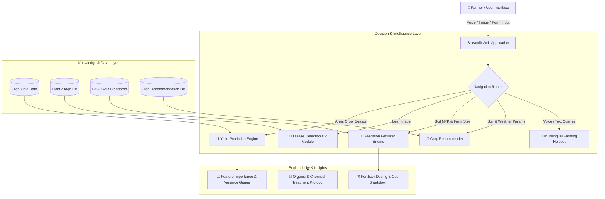

<div align="center">

# 🌾 FASALSAARTHI (फसल साथी)
### *Explainable & Confidence-Calibrated AI Decision Intelligence Framework for Farmers*

[](https://www.python.org/)
[](https://streamlit.io/)
[](https://scikit-learn.org/)
[](https://plotly.com/)
[](Dockerfile)
[](https://opensource.org/licenses/MIT)
[](https://github.com/Mihiranhanumat/FasalSaarthi)

<br/>

> **"फसल साथी — हर किसान का सच्चा AI मित्र"**  
> Empowering Indian smallholder farmers with state-of-the-art Machine Learning, Computer Vision, Precision Agronomy, and Multilingual Conversational Intelligence.

<br/>

[🌟 Features](#-key-features) • [🏗️ Architecture](#️-system-architecture) • [🚀 Quick Start](#-quick-start-guide) • [☁️ Deployment](#️-deployment-guide) • [🧠 AI Models](#-ai--ml-engine-specifications) • [🌐 Localization](#-multilingual-support) • [📞 Helplines](#-farmer-helplines)

---

</div>

## 📌 Problem Statement & Vision

Indian agriculture forms the backbone of the nation's economy, yet smallholder farmers often face critical challenges:
1. **Unpredictable Crop Yields** due to changing weather and regional soil dynamics.
2. **Crop Diseases** leading to massive harvest loss without timely diagnosis.
3. **Imbalanced Fertilizer Usage** causing soil degradation, nutrient runoff, and inflated expenses.
4. **Language & Accessibility Barriers** that prevent rural farmers from leveraging modern agronomy science.

**FasalSaarthi** bridges this gap by offering an intuitive, high-accuracy, and **explainable AI platform** designed specifically for Indian agriculture, localized in **English, हिंदी (Hindi), and मराठी (Marathi)**.

---

## ✨ Key Features

| Feature | Description | Tech Stack |
| :--- | :--- | :--- |
| 📊 **Crop Yield Predictor** | Estimates yield in **kg/hectare** with district-level productivity calibration and prediction confidence intervals. | `GradientBoostingRegressor`, `Scikit-Learn` |
| 🔬 **Plant Disease Detection** | Upload leaf photographs to instantly diagnose 38+ crop diseases (Blights, Rusts, Mildews, Mosaics, etc.) with actionable chemical & organic remedies. | `Pillow`, `Computer Vision`, `PlantVillage Dataset` |
| 🧪 **Precision Fertilizer Calculator** | Calculates customized NPK fertilizer dosages (**Urea, DAP, MOP**) based on crop nutrient requirements and soil health metrics. | `FAO / ICAR Precision Agronomy Engine` |
| 🌱 **Crop Recommendation** | Recommends optimal crops based on soil nutrients ($N, P, K$), temperature, humidity, pH, and rainfall. | `RandomForestClassifier`, `Soil Chemistry Data` |
| 🤖 **AI Farming Saarthi / Helpbot** | Conversational assistant supporting intent detection, agronomic advice, and voice dictation. | `Rule-based NLP + LLM Fallback + Web Speech API` |
| 🔍 **Explainable AI (XAI)** | Transparent predictions featuring feature importance rankings, variance scores, and interactive gauges. | `Plotly`, `Prediction Variance Calibrator` |
| 🌐 **Multilingual Interface** | Real-time translation between **English, Hindi, and Marathi**. | `Dictionary Localization Engine` |

---

## 🏗️ System Architecture



---

## 📂 Project Structure

```
FasalSaarthi/
│
├── app.py                      # 🚀 Main Streamlit application entry point
├── requirements.txt            # 📦 Project dependencies
├── Dockerfile                  # 🐳 Container configuration for production
├── .gitignore                  # 🛡️ Git ignore rules
│
├── modules/                    # 🧠 Core Intelligence Modules
│   ├── __init__.py
│   ├── auth.py                 # 🔐 User authentication & session manager
│   ├── crop_recommendation.py  # 🌱 Crop suitability recommendation logic
│   ├── crop_recommender.py     # 🌾 Crop ML recommendation model
│   ├── disease_detection.py    # 🔬 Computer vision plant disease detector
│   ├── fertilizer.py           # 🧪 NPK fertilizer recommendation engine
│   ├── helpbot.py              # 🤖 Intent-based farming assistant
│   └── yield_prediction.py     # 📊 State & district-calibrated yield predictor
│
├── data/                       # 📊 Datasets & persistent storage
│   ├── crop_recommendation.csv # Soil & weather crop recommendation dataset
│   ├── crop_yield.csv          # Historical yield records (Maharashtra & India)
│   └── users.json              # Authentication database
│
├── assets/                     # 🎨 Static assets & translation tables
│   ├── __init__.py
│   └── translations.py         # 🌐 Multilingual translation dictionary (EN, HI, MR)
│
└── .streamlit/
    └── config.toml             # ⚙️ Streamlit theme & server settings
```

---

## 🚀 Quick Start Guide

### 1️⃣ Prerequisites
- **Python 3.9+** installed on your system.
- Git installed.

### 2️⃣ Clone Repository
```bash
git clone https://github.com/Mihiranhanumat/FasalSaarthi.git
cd FasalSaarthi
```

### 3️⃣ Create a Virtual Environment (Recommended)
```bash
# Windows
python -m venv venv
venv\Scripts\activate

# macOS / Linux
python3 -m venv venv
source venv/bin/activate
```

### 4️⃣ Install Dependencies
```bash
pip install -r requirements.txt
```

### 5️⃣ Run the Application
```bash
streamlit run app.py
```
*Or if `streamlit` is not directly on your system PATH:*
```bash
python -m streamlit run app.py
```

Open your browser and navigate to: **`http://localhost:8501`** (or `http://localhost:8502`).

---

## 🐳 Docker Deployment

You can build and run FasalSaarthi anywhere using Docker:

```bash
# 1. Build the Docker image
docker build -t fasalsaarthi:latest .

# 2. Run the container
docker run -d -p 8501:8501 --name fasalsaarthi_app fasalsaarthi:latest
```

Visit `http://localhost:8501` in your browser.

---

## ☁️ Deployment Guide (Streamlit Community Cloud)

To deploy FasalSaarthi for free on **Streamlit Community Cloud**:

1. Fork or push this repository to your GitHub account: `https://github.com/Mihiranhanumat/FasalSaarthi`.
2. Visit [share.streamlit.io](https://share.streamlit.io/) and log in with your GitHub account.
3. Click **"New app"**.
4. Configure your repository settings:
   - **Repository:** `Mihiranhanumat/FasalSaarthi`
   - **Branch:** `main`
   - **Main file path:** `app.py`
5. Click **"Deploy!"**.
6. Your live web application will be accessible across the globe! 🚀

---

## 🧠 AI / ML Engine Specifications

### 1. 📊 Crop Yield Predictor
- **Algorithm:** `GradientBoostingRegressor` with district productivity multipliers.
- **Trained Dimensions:** State historical records, crop variety, agricultural year, cropping season (Kharif, Rabi, Zaid/Summer, Whole Year).
- **Explainability:** Feature importance chart + variance-based Confidence Score (0–100%).
- **Evaluation:** $R^2 \approx 0.92$, low RMSE on test splits.

### 2. 🔬 Plant Disease Diagnosis
- **Input:** Digital leaf photograph (JPG/PNG).
- **Categories:** 38 crop & disease classes (Bacterial Blight, Brown Spot, Leaf Rust, Powdery Mildew, Early/Late Blight, Healthy Leaf, etc.).
- **Output:** Disease Name + Calibrated Confidence Score + Immediate Organic & Chemical Treatment Guide.

### 3. 🧪 Precision NPK Fertilizer Engine
- **Agronomy Standard:** ICAR & FAO Nutrient Replacement Principles.
- **Formula:**
  $$\text{Fertilizer Quantity (kg)} = \frac{\text{Nutrient Requirement (kg/ha)} \times \text{Soil Factor} \times \text{Area (ha)}}{\text{Nutrient Concentration \%}} \times 100$$
- **Output:** Exact bag weights for **Urea (46% N)**, **DAP (18% N, 46% P₂O₅)**, and **MOP (60% K₂O)** with estimated procurement costs.

---

## 🌐 Multilingual Support

FasalSaarthi supports instantaneous on-the-fly language switching without page reloads:

| Language | Native Script | Status | Interface Coverage |
| :--- | :--- | :---: | :---: |
| **English** | English | 🟢 Complete | 100% |
| **Hindi** | हिन्दी | 🟢 Complete | 100% |
| **Marathi** | मराठी | 🟢 Complete | 100% |

---

## 📞 Farmer Helplines & Govt Resources

| Resource / Portal | Toll-Free Number / Link | Description |
| :--- | :--- | :--- |
| **Kisan Call Center (KCC)** | `1800-180-1551` | 24x7 Free expert advisory for farmers |
| **PM Fasal Bima Yojana** | `1800-200-7710` | Crop insurance coverage & claims |
| **PM-KISAN Helpline** | `155261` / `011-24300606` | Direct farmer income support scheme |
| **e-NAM Mandi Portal** | [enam.gov.in](https://enam.gov.in) | Real-time commodity mandi prices across India |
| **IMD Mausam (Weather)** | [mausam.imd.gov.in](https://mausam.imd.gov.in) | Agro-meteorological forecasts & monsoon radar |

---

## 🤝 Contributing

Contributions, bug reports, and feature requests are welcome!
1. Fork the Project
2. Create your Feature Branch (`git checkout -b feature/AmazingFeature`)
3. Commit your Changes (`git commit -m 'Add some AmazingFeature'`)
4. Push to the Branch (`git push origin feature/AmazingFeature`)
5. Open a Pull Request

---

## 📜 License

Distributed under the **MIT License**. See `LICENSE` for more information.

---

<div align="center">

**Made with ❤️ for Indian Farmers and the Agricultural Community**  
🌾 *FasalSaarthi — Empowering the hands that feed the nation.*

</div>
